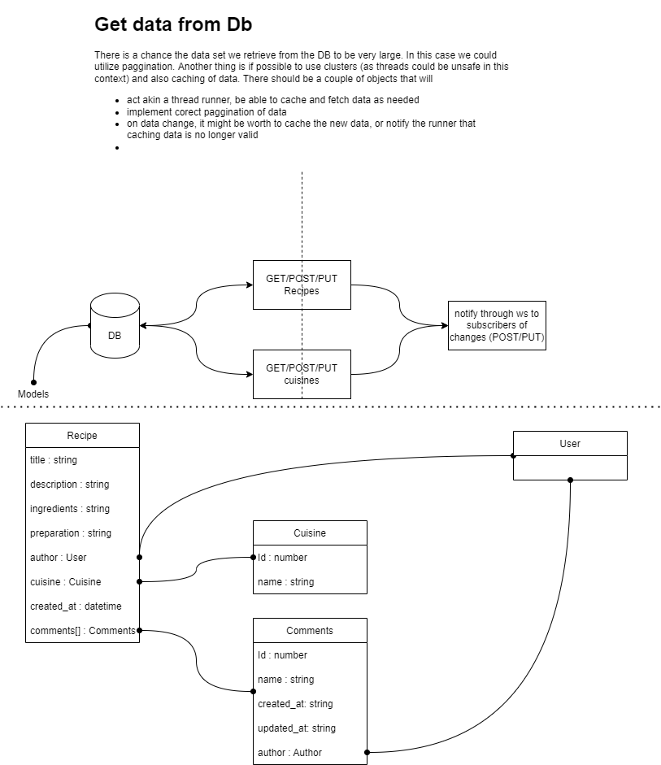

# django-recipes-api

Idea behind that is to create a small api that users can use to share recipes and comment on other people recipes.

## Initial design

- For future:
  - expand with websocket to notify users on changes on subscribed recipes

- Added a small API that will fetch cuicines and recipes from a remote db
- small proof of concept user login for comments sytem
